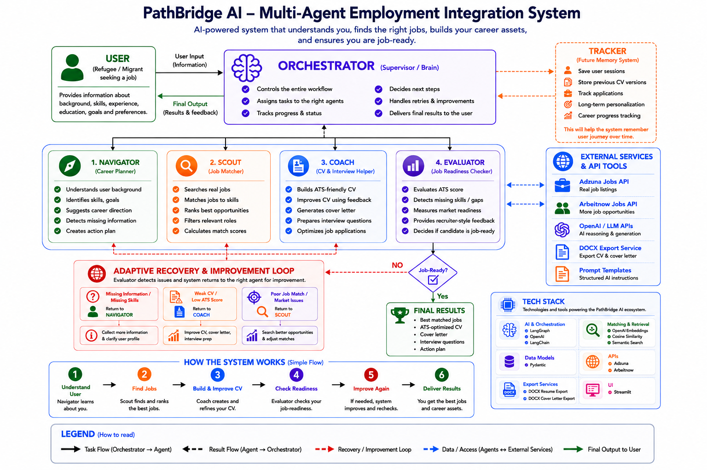
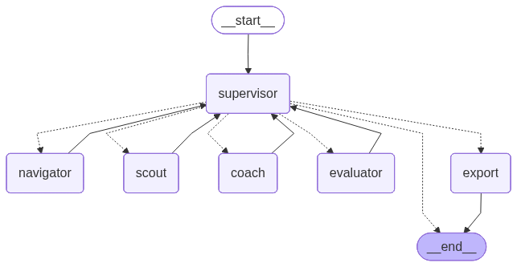
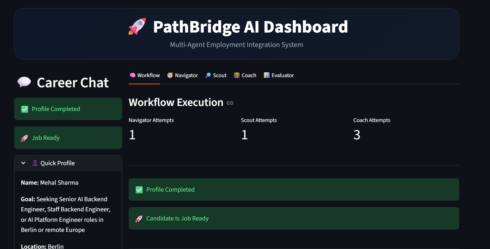
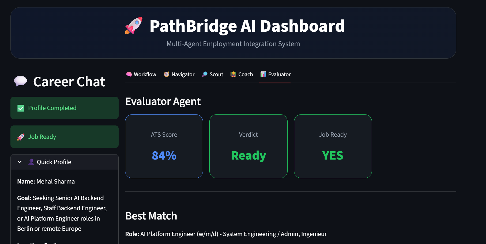

# PathBridge AI – Multi-Agent Employment Integration System
### AI-powered career intelligence platform for job matching, CV optimization, skill-gap analysis, and career-readiness assessment.

## Overview

PathBridge AI is an AI-powered multi-agent career intelligence platform designed to help job seekers discover relevant opportunities, evaluate career readiness, identify skill gaps, optimize CVs, and receive personalized career guidance.

Built using LangGraph, Azure OpenAI, Python, Pydantic, and Streamlit, the platform demonstrates how specialized AI agents can collaborate through orchestrated workflows to solve complex career decision-making challenges.

The system combines profile analysis, job matching, CV evaluation, skill-gap assessment, and AI-powered coaching into a unified end-to-end experience.

**Project Type:** Portfolio Showcase Project  
**Domain:** Career Intelligence & Decision Support  
**Technology Focus:** Agentic AI, Multi-Agent Systems, Workflow Orchestration, Generative AI, LLM Applications

---

## Key Features

### Career Profile Understanding

* Extracts candidate skills, experience, education, and career goals
* Creates structured professional profiles
* Supports personalized career planning workflows

### Intelligent Job Discovery

* Retrieves relevant job opportunities
* Ranks positions based on candidate-job fit
* Highlights high-potential career opportunities

### Skill Gap Analysis

* Compares candidate profiles against job requirements
* Identifies missing skills and competency gaps
* Generates targeted improvement recommendations

### Career Coaching

* Provides CV optimization recommendations
* Supports interview preparation
* Generates personalized career guidance

### Multi-Agent Workflow Orchestration

* Coordinates specialized AI agents
* Manages workflow execution using LangGraph
* Enables scalable and explainable decision-support pipelines

---

## Agent Architecture

The platform is composed of specialized AI agents collaborating through a centralized orchestration layer.

| Agent              | Responsibility                                             |
| ------------------ | ---------------------------------------------------------- |
| Navigator Agent    | Profile analysis and career goal understanding             |
| Scout Agent        | Job discovery, retrieval, and ranking                      |
| Evaluator Agent    | Job-fit scoring and skill-gap assessment                   |
| Coach Agent        | Career guidance, CV improvement, and interview preparation |
| Orchestrator Agent | Workflow coordination and agent routing                    |

---

## System Architecture

---

## System Behaviour

---

## User Interface

### Workflow Dashboard

The workflow dashboard visualizes the execution of the multi-agent pipeline and tracks the progression of candidate evaluation.

### Evaluation & Career Readiness

The evaluation dashboard presents ATS scoring, job readiness assessment, and candidate-job fit insights.

---

## Technology Stack

* Python
* LangGraph
* Azure OpenAI
* Streamlit
* Pydantic
* Semantic Search
* Vector Similarity Scoring
* GitHub

---

## Technical Highlights

* Multi-agent AI architecture
* LangGraph workflow orchestration
* Shared state management
* Azure OpenAI integration
* Prompt engineering and agent design
* Structured validation using Pydantic
* Skill-gap assessment framework
* Interactive Streamlit dashboard
* Explainable AI decision-support workflows

---

## Business Value

PathBridge AI demonstrates how agentic AI systems can support career development through intelligent automation.

### Key Outcomes

* Faster discovery of relevant opportunities
* Improved CV-job alignment
* Automated skill-gap identification
* Personalized interview preparation
* Explainable career recommendations
* Streamlined career readiness assessment

The project combines workflow orchestration, semantic search, and LLM-powered reasoning into a practical end-to-end career intelligence solution.

---

## My Contributions

As a member of the project team, I contributed to:

* Multi-agent workflow design
* LangGraph implementation and orchestration
* Azure OpenAI integration
* Prompt engineering and agent development
* Skill-gap assessment framework
* Testing, debugging, and optimization
* Streamlit dashboard enhancements
* Technical documentation and project presentation

---

## Skills Demonstrated

**Agentic AI • Multi-Agent Systems • LangGraph • Azure OpenAI • Python • Prompt Engineering • Workflow Orchestration • Streamlit • Semantic Search • LLM Applications • Career Intelligence Systems**

---

## Future Enhancements

* Persistent user memory and personalization
* Enhanced job matching accuracy
* Additional job board integrations
* Advanced analytics and reporting
* Workflow monitoring dashboard
* Continuous feedback and learning loops
* Production deployment

---

## Disclaimer

This repository is a showcase version created for portfolio and demonstration purposes. Implementation details, proprietary logic, prompts, and production source code are not included.
